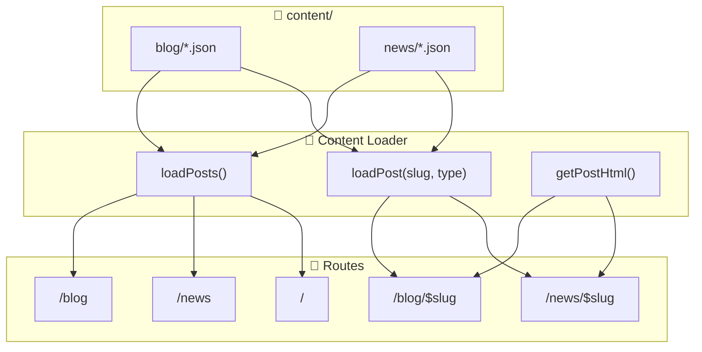

The Builder Coil is the public builder's log of Nicolas Brulay/Ball Lightning AB, documenting the journey of this small agentic development studio.
This includes the creation of Chronomation.

🌀 Vision
Chronomation is a multi-tenant content engine that turns raw work artifacts (commits, notes, emails, etc.) into structured blog posts and social content for SMBs, creators, and influencers.

The Builder Coil (TBC) is the first tenant and public case study: a builder's log for Ball Lightning AB, powered by Chronomation's APIs.

📚 Shared Brand System
This project is part of the Ball Lightning AB ecosystem and shares architecture, policies, and design systems with other projects. See the [Ball Lightning Brand System](https://github.com/BallLightningAB/brand-system) for shared resources:
- [Shared Ecosystem PDD](https://github.com/BallLightningAB/brand-system/blob/main/shared-ecosystem-pdd.yaml)
- [Shared Architecture](https://github.com/BallLightningAB/brand-system/blob/main/shared-architecture.yaml)
- [Shared Design System](https://github.com/BallLightningAB/brand-system/blob/main/shared-design-system.yaml)

🎯 Purpose
The Builder Coil serves two main goals:
Transparency & Community – Share the journey of Ball Lightning AB.
Product Dogfooding – Test and showcase Chronomation in a real-world, production setting.

🧠 Tech Stack
Tanstack Start, TailwindCSS, Shadcn UI, Biome + Ultracite

🌐 Domain
https://thebuildercoil.com

## Security baseline

The Builder Coil treats secret leakage as a first-class concern:

- **Local pre-commit hooks**: `detect-private-key` and `gitleaks protect` run on every `git commit` via `.pre-commit-config.yaml`. Before committing, install `pre-commit` and `gitleaks` globally and run `pre-commit install` in this repo.
- **CI secret scanning**: The GitHub Actions workflow `.github/workflows/secret-scan.yml` runs Gitleaks on pushes and pull requests to `main`, uploading results to the repository’s Security tab.
- **Shared configuration**: `gitleaks.toml` centralizes allowlists and rules shared between local and CI scans; avoid weakening this config unless there is a clear, documented justification.

## Validation (zod)

This project uses [zod](https://zod.dev/) for runtime validation and type inference.
A central helper is defined in `src/lib/validation/zod.ts`. When adding schemas for
env, loaders, or forms, import `z` from there:

```ts
import { z } from "@/lib/validation/zod";
```

## Content Management (Phase 1)

In Phase 1, The Builder Coil uses a local JSON-based content system. This will migrate to the Chronomation API in Phase 2.

### Content Flow



### Adding a New Blog Post

1. Create a JSON file in `content/blog/` with naming convention: `YYYY-MM-DD-slug-name.json`
2. Use this structure:

```json
{
  "id": "unique-id",
  "slug": "slug-name",
  "title": "Your Post Title",
  "type": "blog",
  "summary": "Brief description for cards and SEO",
  "body": "# Markdown content here...",
  "bodyIsMarkdown": true,
  "heroImage": "/media/your-image.png",
  "heroImageAlt": "Alt text",
  "tags": ["tag1", "tag2"],
  "author": "Author Name",
  "status": "published",
  "publishedAt": "2025-01-01T12:00:00.000Z",
  "createdAt": "2025-01-01T10:00:00.000Z",
  "updatedAt": "2025-01-01T12:00:00.000Z"
}
```

Images for `heroImage` and other inline content should be placed in
`public/media` and referenced using `/media/...` paths. Phase 1 keeps media
simple (static files in the repo) while matching the media_hosting_strategy in
the PDD so that Chronomation or external URLs can later replace the local
`/media` paths without changing rendering code.

For long-form posts, you can optionally store the full body in a separate
markdown file next to the JSON file and reference it with a `bodyFile` field
(for example `"bodyFile": "YYYY-MM-DD-slug-name.md"`). The loader will read
from that file at runtime, and `body` in the JSON can stay a short stub (such
as the title heading) to keep diffs small and editing pleasant.

Bodies are written in markdown (whether inline in `body` or loaded via
`bodyFile`), so you can add links using normal markdown syntax. For internal
links between posts, prefer absolute paths that match the routes:

- Blog post: `[Chronomation: Key Architecture Decisions](/blog/chronomation-architecture-decisions)`
- News item: `[The Builder Coil is Live](/news/the-builder-coil-is-live)`
- External: `[TanStack Start](https://tanstack.com/start)`

These links should live in the `.md` body files alongside the JSON so content
remains easy to edit.

3. Set `status: "published"` when ready to go live (drafts are filtered out)
4. The dev server will automatically pick up the new file

### Adding News

Same process as blog posts, but place files in `content/news/` and set `type: "news"`.

### Media hosting (Phase 1)

- Images for hero sections and inline content live under `public/media` and are
  referenced from JSON as `/media/...` paths (for example `/media/welcome-hero.png`).
- This keeps Phase 1 simple (static files in the repo) and matches the
  `media_hosting_strategy` in the PDD so that Chronomation- or CDN-hosted URLs
  can later replace the local `/media` paths without changing rendering code.
- For **very small, low-traffic video clips**, you may optionally place
  short `.mp4` files under `public/media/*.mp4`, but the default strategy for
  richer video is to upload to YouTube and embed via URL (see PDD
  `video_strategy.phase_1_tbc_only`).

Phase 2 of the media strategy (Chronomation-managed object storage, shared
`media.chronomation.com` host, and optional per-tenant vanity media domains)
is defined in the [Shared Architecture](https://github.com/BallLightningAB/brand-system/blob/main/shared-architecture.yaml) under
`architecture.media_hosting_strategy`. When that is implemented, `heroImage` and inline
media URLs will typically point at Chronomation/CDN URLs instead of
`/media/...`, but the rendering code and content JSON shape remain the same.

### Endpoints

- **Feed API**: `GET /api/feed` - Public endpoint returning minimal metadata for published blog and news posts, designed for Ball Lightning integration.

**Response Format:**
```json
{
  "items": [
    {
      "type": "blog" | "news",
      "title": "Post Title",
      "slug": "post-slug",
      "url": "https://thebuildercoil.com/blog/post-slug",
      "publishedAt": "2026-01-23T18:00:00.000Z",
      "excerpt": "Brief summary of the post...",
      "image": {
        "url": "https://thebuildercoil.com/media/image.webp",
        "alt": "Image alt text"
      } | undefined
    }
  ],
  "meta": {
    "count": 8,
    "generatedAt": "2026-01-23T20:12:11.610Z"
  }
}
```

**Headers:**
- `Cache-Control: public, max-age=300, stale-while-revalidate=600`
- `Access-Control-Allow-Origin: *`
- `Content-Type: application/json`

**Usage Notes:**
- Returns only published posts (filtered by `publishedAt <= now`)
- Sorted by `publishedAt` descending (newest first)
- Images are absolute URLs and can be displayed directly
- TypeScript types available at `src/routes/api/feed.types.ts`

## Project Documentation

This project's documentation is organized as follows:

### Core Documents
- **[The Builder Coil PDD](specs/memory-bank/thebuildercoil-pdd.yaml)** - Project-specific Product Definition Document
- **[Memory Bank Usage Guide](specs/memory-bank/memory-bank-usage.yaml)** - How to use the memory bank system
- **[CHANGELOG](specs/memory-bank/CHANGELOG.yaml)** - Version history and release tracking
- **[Active Context](specs/memory-bank/active-context.yaml)** - Current roadmap and progress tracking

### Shared Ecosystem Resources
- **[Shared Ecosystem PDD](https://github.com/BallLightningAB/brand-system/blob/main/shared-ecosystem-pdd.yaml)** - Ecosystem-wide product definitions
- **[Shared Architecture](https://github.com/BallLightningAB/brand-system/blob/main/shared-architecture.yaml)** - Common architecture patterns and policies
- **[Shared Design System](https://github.com/BallLightningAB/brand-system/blob/main/shared-design-system.yaml)** - Design tokens, components, and guidelines

## License & Funding
- License: see [LICENSE.md](LICENSE.md)
- Funding: see [FUNDING.yml](FUNDING.yml)

## © 2025 Nicolas Brulay / Ball Lightning AB