The Builder Coil is the public builder's log of Nicolas Brulay/Ball Lightning AB, documenting the journey of this small agentic development studio.
This includes the creation of Chronomation.

🌀 Vision
Chronomation is a multi-tenant content engine that turns raw work artifacts (commits, notes, emails, etc.) into structured blog posts and social content for SMBs, creators, and influencers.

The Builder Coil (TBC) is the first tenant and public case study: a builder's log for Ball Lightning AB, powered by Chronomation's APIs.

📚 Shared Brand System
This project is part of the Ball Lightning AB ecosystem and shares architecture, policies, and design systems with other projects. See the [Ball Lightning Brand System](https://github.com/BallLightningAB/brand-system) for shared resources:
- [Shared Ecosystem PDD](https://github.com/BallLightningAB/brand-system/blob/main/shared-ecosystem-pdd.yaml)
- [Shared Architecture](https://github.com/BallLightningAB/brand-system/blob/main/shared-architecture.yaml)
- [Shared Design System](https://github.com/BallLightningAB/brand-system/blob/main/shared-design-system.yaml)

🎯 Purpose
The Builder Coil serves two main goals:
Transparency & Community – Share the journey of Ball Lightning AB.
Product Dogfooding – Test and showcase Chronomation in a real-world, production setting.

🧠 Tech Stack
Tanstack Start, TailwindCSS, Shadcn UI, Biome + Ultracite

🌐 Domain
https://thebuildercoil.com

© 2025 Nicolas Brulay / Ball Lightning AB

## Security baseline

The Builder Coil treats secret leakage as a first-class concern:

- **Local pre-commit hooks**: `detect-private-key` and `gitleaks protect` run on every `git commit` via `.pre-commit-config.yaml`. Before committing, install `pre-commit` and `gitleaks` globally and run `pre-commit install` in this repo.
- **CI secret scanning**: The GitHub Actions workflow `.github/workflows/secret-scan.yml` runs Gitleaks on pushes and pull requests to `main`, uploading results to the repository’s Security tab.
- **Shared configuration**: `gitleaks.toml` centralizes allowlists and rules shared between local and CI scans; avoid weakening this config unless there is a clear, documented justification.

## Validation (zod)

This project uses [zod](https://zod.dev/) for runtime validation and type inference.
A central helper is defined in `src/lib/validation/zod.ts`. When adding schemas for
env, loaders, or forms, import `z` from there:

```ts
import { z } from "@/lib/validation/zod";
```

## Content Management (Phase 1)

In Phase 1, The Builder Coil uses a local JSON-based content system. This will migrate to the Chronomation API in Phase 2.

### Content Flow

```mermaid
flowchart TD
    subgraph Content["📁 content/"]
        Blog["blog/*.json"]
        News["news/*.json"]
    end

    subgraph Loader["🔄 Content Loader"]
        LoadPosts["loadPosts()"]
        LoadPost["loadPost(slug, type)"]
        GetHtml["getPostHtml()"]
    end

    subgraph Routes["📄 Routes"]
        BlogIndex["/blog"]
        BlogDetail["/blog/$slug"]
        NewsIndex["/news"]
        NewsDetail["/news/$slug"]
        Home["/"]
    end

    Blog --> LoadPosts
    News --> LoadPosts
    Blog --> LoadPost
    News --> LoadPost
    
    LoadPosts --> BlogIndex
    LoadPosts --> NewsIndex
    LoadPosts --> Home
    
    LoadPost --> BlogDetail
    LoadPost --> NewsDetail
    
    GetHtml --> BlogDetail
    GetHtml --> NewsDetail
```



### Adding a New Blog Post

1. Create a JSON file in `content/blog/` with naming convention: `YYYY-MM-DD-slug-name.json`
2. Use this structure:

```json
{
  "id": "unique-id",
  "slug": "slug-name",
  "title": "Your Post Title",
  "type": "blog",
  "summary": "Brief description for cards and SEO",
  "body": "# Markdown content here...",
  "bodyIsMarkdown": true,
  "heroImage": "/media/your-image.png",
  "heroImageAlt": "Alt text",
  "tags": ["tag1", "tag2"],
  "author": "Author Name",
  "status": "published",
  "publishedAt": "2025-01-01T12:00:00.000Z",
  "createdAt": "2025-01-01T10:00:00.000Z",
  "updatedAt": "2025-01-01T12:00:00.000Z"
}
```

Images for `heroImage` and other inline content should be placed in
`public/media` and referenced using `/media/...` paths. Phase 1 keeps media
simple (static files in the repo) while matching the media_hosting_strategy in
the PDD so that Chronomation or external URLs can later replace the local
`/media` paths without changing rendering code.

For long-form posts, you can optionally store the full body in a separate
markdown file next to the JSON file and reference it with a `bodyFile` field
(for example `"bodyFile": "YYYY-MM-DD-slug-name.md"`). The loader will read
from that file at runtime, and `body` in the JSON can stay a short stub (such
as the title heading) to keep diffs small and editing pleasant.

Bodies are written in markdown (whether inline in `body` or loaded via
`bodyFile`), so you can add links using normal markdown syntax. For internal
links between posts, prefer absolute paths that match the routes:

- Blog post: `[Chronomation: Key Architecture Decisions](/blog/chronomation-architecture-decisions)`
- News item: `[The Builder Coil is Live](/news/the-builder-coil-is-live)`
- External: `[TanStack Start](https://tanstack.com/start)`

These links should live in the `.md` body files alongside the JSON so content
remains easy to edit.

3. Set `status: "published"` when ready to go live (drafts are filtered out)
4. The dev server will automatically pick up the new file

### Adding News

Same process as blog posts, but place files in `content/news/` and set `type: "news"`.

### Media hosting (Phase 1)

- Images for hero sections and inline content live under `public/media` and are
  referenced from JSON as `/media/...` paths (for example `/media/welcome-hero.png`).
- This keeps Phase 1 simple (static files in the repo) and matches the
  `media_hosting_strategy` in the PDD so that Chronomation- or CDN-hosted URLs
  can later replace the local `/media` paths without changing rendering code.
- For **very small, low-traffic video clips**, you may optionally place
  short `.mp4` files under `public/media/*.mp4`, but the default strategy for
  richer video is to upload to YouTube and embed via URL (see PDD
  `video_strategy.phase_1_tbc_only`).

Phase 2 of the media strategy (Chronomation-managed object storage, shared
`media.chronomation.com` host, and optional per-tenant vanity media domains)
is defined in the [Shared Architecture](https://github.com/BallLightningAB/brand-system/blob/main/shared-architecture.yaml) under
`architecture.media_hosting_strategy`. When that is implemented, `heroImage` and inline
media URLs will typically point at Chronomation/CDN URLs instead of
`/media/...`, but the rendering code and content JSON shape remain the same.

### Endpoints

- **Feed API**: `GET /api/feed` - Public endpoint returning minimal metadata for published blog and news posts, designed for Ball Lightning integration.

**Response Format:**
```json
{
  "items": [
    {
      "type": "blog" | "news",
      "title": "Post Title",
      "slug": "post-slug",
      "url": "https://thebuildercoil.com/blog/post-slug",
      "publishedAt": "2026-01-23T18:00:00.000Z",
      "excerpt": "Brief summary of the post...",
      "image": {
        "url": "https://thebuildercoil.com/media/image.webp",
        "alt": "Image alt text"
      } | undefined
    }
  ],
  "meta": {
    "count": 8,
    "generatedAt": "2026-01-23T20:12:11.610Z"
  }
}
```

**Headers:**
- `Cache-Control: public, max-age=300, stale-while-revalidate=600`
- `Access-Control-Allow-Origin: *`
- `Content-Type: application/json`

**Usage Notes:**
- Returns only published posts (filtered by `publishedAt <= now`)
- Sorted by `publishedAt` descending (newest first)
- Images are absolute URLs and can be displayed directly
- TypeScript types available at `src/routes/api/feed.types.ts`

## Project Documentation

This project's documentation is organized as follows:

### Core Documents
- **[The Builder Coil PDD](specs/memory-bank/thebuildercoil-pdd.yaml)** - Project-specific Product Definition Document
- **[Memory Bank Usage Guide](specs/memory-bank/memory-bank-usage.yaml)** - How to use the memory bank system
- **[CHANGELOG](specs/memory-bank/CHANGELOG.yaml)** - Version history and release tracking
- **[Active Context](specs/memory-bank/active-context.yaml)** - Current roadmap and progress tracking

### Shared Ecosystem Resources
- **[Shared Ecosystem PDD](https://github.com/BallLightningAB/brand-system/blob/main/shared-ecosystem-pdd.yaml)** - Ecosystem-wide product definitions
- **[Shared Architecture](https://github.com/BallLightningAB/brand-system/blob/main/shared-architecture.yaml)** - Common architecture patterns and policies
- **[Shared Design System](https://github.com/BallLightningAB/brand-system/blob/main/shared-design-system.yaml)** - Design tokens, components, and guidelines

---

KEEP BELOW FOR NOW

Welcome to your new TanStack app!

# Getting Started

To run this application:

```bash
pnpm install
pnpm start
```

# Building For Production

To build this application for production:

```bash
pnpm build
```

## Testing

This project uses [Vitest](https://vitest.dev/) for testing. You can run the tests with:

```bash
pnpm test
```

## Styling

This project uses [Tailwind CSS](https://tailwindcss.com/) for styling.

## Linting & Formatting

This project uses [Biome](https://biomejs.dev/) for linting and formatting. The following scripts are available:

```bash
pnpm lint
pnpm format
pnpm check
```

## Shadcn

Add components using the latest version of [Shadcn](https://ui.shadcn.com/).

```bash
pnpx shadcn@latest add button
```

## Routing

This project uses [TanStack Router](https://tanstack.com/router). The initial setup is a file based router. Which means that the routes are managed as files in `src/routes`.

### Adding A Route

To add a new route to your application just add another a new file in the `./src/routes` directory.

TanStack will automatically generate the content of the route file for you.

Now that you have two routes you can use a `Link` component to navigate between them.

### Adding Links

To use SPA (Single Page Application) navigation you will need to import the `Link` component from `@tanstack/react-router`.

```tsx
import { Link } from "@tanstack/react-router";
```

Then anywhere in your JSX you can use it like so:

```tsx
<Link to="/about">About</Link>
```

This will create a link that will navigate to the `/about` route.

More information on the `Link` component can be found in the [Link documentation](https://tanstack.com/router/v1/docs/framework/react/api/router/linkComponent).

### Using A Layout

In the File Based Routing setup the layout is located in `src/routes/__root.tsx`. Anything you add to the root route will appear in all the routes. The route content will appear in the JSX where you use the `<Outlet />` component.

Here is an example layout that includes a header:

```tsx
import { Outlet, createRootRoute } from "@tanstack/react-router";
import { TanStackRouterDevtools } from "@tanstack/react-router-devtools";

import { Link } from "@tanstack/react-router";

export const Route = createRootRoute({
  component: () => (
    <>
      <header>
        <nav>
          <Link to="/">Home</Link>
          <Link to="/about">About</Link>
        </nav>
      </header>
      <Outlet />
      <TanStackRouterDevtools />
    </>
  ),
});
```

The `<TanStackRouterDevtools />` component is not required so you can remove it if you don't want it in your layout.

More information on layouts can be found in the [Layouts documentation](https://tanstack.com/router/latest/docs/framework/react/guide/routing-concepts#layouts).

## Data Fetching

There are multiple ways to fetch data in your application. You can use TanStack Query to fetch data from a server. But you can also use the `loader` functionality built into TanStack Router to load the data for a route before it's rendered.

For example:

```tsx
const peopleRoute = createRoute({
  getParentRoute: () => rootRoute,
  path: "/people",
  loader: async () => {
    const response = await fetch("https://swapi.dev/api/people");
    return response.json() as Promise<{
      results: {
        name: string;
      }[];
    }>;
  },
  component: () => {
    const data = peopleRoute.useLoaderData();
    return (
      <ul>
        {data.results.map((person) => (
          <li key={person.name}>{person.name}</li>
        ))}
      </ul>
    );
  },
});
```

Loaders simplify your data fetching logic dramatically. Check out more information in the [Loader documentation](https://tanstack.com/router/latest/docs/framework/react/guide/data-loading#loader-parameters).

### React-Query

React-Query is an excellent addition or alternative to route loading and integrating it into you application is a breeze.

First add your dependencies:

```bash
pnpm add @tanstack/react-query @tanstack/react-query-devtools
```

Next we'll need to create a query client and provider. We recommend putting those in `main.tsx`.

```tsx
import { QueryClient, QueryClientProvider } from "@tanstack/react-query";

// ...

const queryClient = new QueryClient();

// ...

if (!rootElement.innerHTML) {
  const root = ReactDOM.createRoot(rootElement);

  root.render(
    <QueryClientProvider client={queryClient}>
      <RouterProvider router={router} />
    </QueryClientProvider>
  );
}
```

You can also add TanStack Query Devtools to the root route (optional).

```tsx
import { ReactQueryDevtools } from "@tanstack/react-query-devtools";

const rootRoute = createRootRoute({
  component: () => (
    <>
      <Outlet />
      <ReactQueryDevtools buttonPosition="top-right" />
      <TanStackRouterDevtools />
    </>
  ),
});
```

Now you can use `useQuery` to fetch your data.

```tsx
import { useQuery } from "@tanstack/react-query";

import "./App.css";

function App() {
  const { data } = useQuery({
    queryKey: ["people"],
    queryFn: () =>
      fetch("https://swapi.dev/api/people")
        .then((res) => res.json())
        .then((data) => data.results as { name: string }[]),
    initialData: [],
  });

  return (
    <div>
      <ul>
        {data.map((person) => (
          <li key={person.name}>{person.name}</li>
        ))}
      </ul>
    </div>
  );
}

export default App;
```

You can find out everything you need to know on how to use React-Query in the [React-Query documentation](https://tanstack.com/query/latest/docs/framework/react/overview).

## State Management

Another common requirement for React applications is state management. There are many options for state management in React. TanStack Store provides a great starting point for your project.

First you need to add TanStack Store as a dependency:

```bash
pnpm add @tanstack/store
```

Now let's create a simple counter in the `src/App.tsx` file as a demonstration.

```tsx
import { useStore } from "@tanstack/react-store";
import { Store } from "@tanstack/store";
import "./App.css";

const countStore = new Store(0);

function App() {
  const count = useStore(countStore);
  return (
    <div>
      <button onClick={() => countStore.setState((n) => n + 1)}>
        Increment - {count}
      </button>
    </div>
  );
}

export default App;
```

One of the many nice features of TanStack Store is the ability to derive state from other state. That derived state will update when the base state updates.

Let's check this out by doubling the count using derived state.

```tsx
import { useStore } from "@tanstack/react-store";
import { Store, Derived } from "@tanstack/store";
import "./App.css";

const countStore = new Store(0);

const doubledStore = new Derived({
  fn: () => countStore.state * 2,
  deps: [countStore],
});
doubledStore.mount();

function App() {
  const count = useStore(countStore);
  const doubledCount = useStore(doubledStore);

  return (
    <div>
      <button onClick={() => countStore.setState((n) => n + 1)}>
        Increment - {count}
      </button>
      <div>Doubled - {doubledCount}</div>
    </div>
  );
}

export default App;
```

We use the `Derived` class to create a new store that is derived from another store. The `Derived` class has a `mount` method that will start the derived store updating.

Once we've created the derived store we can use it in the `App` component just like we would any other store using the `useStore` hook.

You can find out everything you need to know on how to use TanStack Store in the [TanStack Store documentation](https://tanstack.com/store/latest).

# Demo files

Files prefixed with `demo` can be safely deleted. They are there to provide a starting point for you to play around with the features you've installed.

# Learn More

You can learn more about all of the offerings from TanStack in the [TanStack documentation](https://tanstack.com).
